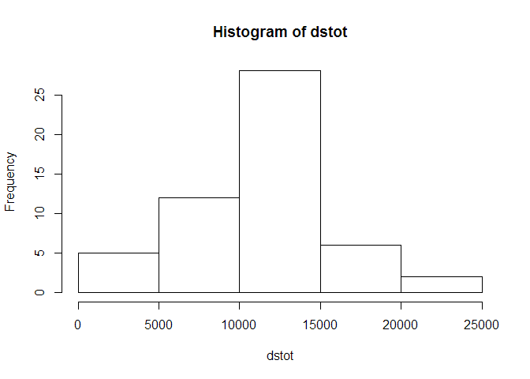
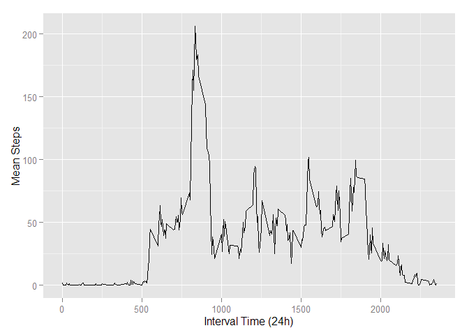
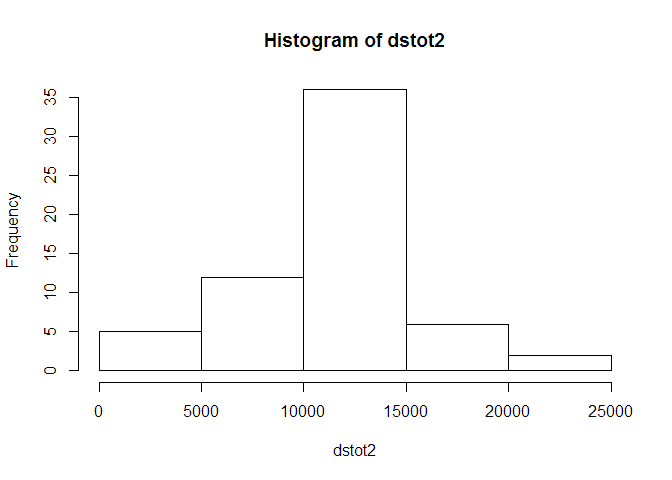
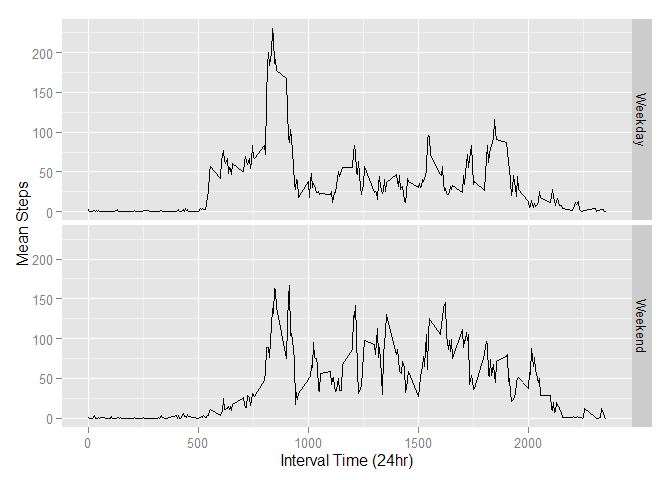

# Peer Review Assignment 1
   
July 19, 2015  

This assignment makes use of data from a personal activity monitoring device. This device collects data at 5 minute intervals through out the day. The data consists of two months of data from an anonymous individual collected during the months of October and November, 2012 and include the number of steps taken in 5 minute intervals each day.

To analyise these data, the first thing needed is to import the data into R, and then ready the ggplot library, which we will use for most of our plots.


```r
act<-read.csv ("activity.csv", stringsAsFactors = FALSE)

library(ggplot2)
```

```
## Warning: package 'ggplot2' was built under R version 3.2.1
```
Queston 1: What is mean total number of steps taken per day?

1.1 Calculate the total number of steps taken per day

We can run some code to see the total number of steps for all the days:


```r
dstot<-tapply(act$steps,act$date,sum)
print (dstot)
```

```
## 2012-10-01 2012-10-02 2012-10-03 2012-10-04 2012-10-05 2012-10-06 
##         NA        126      11352      12116      13294      15420 
## 2012-10-07 2012-10-08 2012-10-09 2012-10-10 2012-10-11 2012-10-12 
##      11015         NA      12811       9900      10304      17382 
## 2012-10-13 2012-10-14 2012-10-15 2012-10-16 2012-10-17 2012-10-18 
##      12426      15098      10139      15084      13452      10056 
## 2012-10-19 2012-10-20 2012-10-21 2012-10-22 2012-10-23 2012-10-24 
##      11829      10395       8821      13460       8918       8355 
## 2012-10-25 2012-10-26 2012-10-27 2012-10-28 2012-10-29 2012-10-30 
##       2492       6778      10119      11458       5018       9819 
## 2012-10-31 2012-11-01 2012-11-02 2012-11-03 2012-11-04 2012-11-05 
##      15414         NA      10600      10571         NA      10439 
## 2012-11-06 2012-11-07 2012-11-08 2012-11-09 2012-11-10 2012-11-11 
##       8334      12883       3219         NA         NA      12608 
## 2012-11-12 2012-11-13 2012-11-14 2012-11-15 2012-11-16 2012-11-17 
##      10765       7336         NA         41       5441      14339 
## 2012-11-18 2012-11-19 2012-11-20 2012-11-21 2012-11-22 2012-11-23 
##      15110       8841       4472      12787      20427      21194 
## 2012-11-24 2012-11-25 2012-11-26 2012-11-27 2012-11-28 2012-11-29 
##      14478      11834      11162      13646      10183       7047 
## 2012-11-30 
##         NA
```
1.2 Make a histogram of the total number of steps taken each day.

USing the base plotting system, we can make this histogram, just to see the frequency of days that have various numbers of steps:

```r
hist(dstot)
```

 

1.3 Calculate and report the mean and median of the total number of steps taken per day.

This we can do with some more simple code:

```r
mean(dstot[!is.na(dstot)])
```

```
## [1] 10766.19
```

```r
median(dstot[!is.na(dstot)])
```

```
## [1] 10765
```
Question 2: What is the average daily activity pattern?

2.1 Make a time series plot  of the 5-minute interval (x-axis) and the average number of steps taken, averaged across all days (y-axis).

To do this we can arrage the data so that the means of each interval are plotable...

```r
ismean<-tapply(act$steps[!is.na(act$steps)],act$interval[!is.na(act$steps)],mean)
ismean2<- data.frame(ismean)
ismean2<-cbind (ismean2,as.integer(dimnames(ismean)[[1]]))
names(ismean2)<-c("meansteps","interval")
```

...and then make the plot.


```r
 qplot(interval, meansteps, data =ismean2,
          ylab="Mean Steps", xlab="Interval Time (24h)", geom = "line")
```

 


2.2 Which 5-minute interval, on average across all the days in the dataset, contains the maximum number of steps?

For this we can find the interval where the max number of average steps occurs:


```r
c(max(ismean2$meansteps),ismean2$interval[ismean2$meansteps==max(ismean2$meansteps)])
```

```
## [1] 206.1698 835.0000
```

Question 3. Imputing missing values

Note that there are a number of days/intervals where there are missing values (coded as NA). The presence of missing days may introduce bias into some calculations or summaries of the data.

3.1 Calculate and report the total number of missing values in the dataset (i.e. the total number of rows with NAs)

Noting the logical trues are equal 1 when summed, we can come up with the number of obersvations with missing values:

```r
sum(is.na(act))
```

```
## [1] 2304
```

3.2 2.Devise a strategy for filling in all of the missing values in the dataset. The strategy does not need to be sophisticated. For example, you could use the mean/median for that day, or the mean for that 5-minute interval, etc.

For this analysis, we will be inserting the average daily values into all the missing values by merging the data sets on the inverval variable:


```r
imp<-c(round(ismean2[1]))
imp<-data.frame(imp)
imp<-cbind(imp,as.integer(rownames(imp)))
names(imp)<- c("steps","interval")
actimp<- merge(act,imp,by="interval")
actimp<-actimp[order(actimp$date,actimp$interval),]
actimp$steps.z<-actimp$steps.x
actimp$steps.z[is.na(actimp$steps.z)]<-actimp$steps.y[is.na(actimp$steps.z)]
```

3.3 Create a new dataset that is equal to the original dataset but with the missing data filled in.

Once we have the merged set, we can use the column with no NA values as our value for number of steps for all observations:


```r
actimp2<-actimp[c(1,3,5)]
```

3.4 Make a histogram of the total number of steps taken each day and Calculate and report the mean and median total number of steps taken per day. Do these values differ from the estimates from the first part of the assignment? What is the impact of imputing missing data on the estimates of the total daily number of steps?

To answer these questions we will provde the same output as we had for the data with no imputation:

```r
dstot2<-tapply(actimp2$steps,act$date,sum)
print (dstot2)
```

```
## 2012-10-01 2012-10-02 2012-10-03 2012-10-04 2012-10-05 2012-10-06 
##      10762        126      11352      12116      13294      15420 
## 2012-10-07 2012-10-08 2012-10-09 2012-10-10 2012-10-11 2012-10-12 
##      11015      10762      12811       9900      10304      17382 
## 2012-10-13 2012-10-14 2012-10-15 2012-10-16 2012-10-17 2012-10-18 
##      12426      15098      10139      15084      13452      10056 
## 2012-10-19 2012-10-20 2012-10-21 2012-10-22 2012-10-23 2012-10-24 
##      11829      10395       8821      13460       8918       8355 
## 2012-10-25 2012-10-26 2012-10-27 2012-10-28 2012-10-29 2012-10-30 
##       2492       6778      10119      11458       5018       9819 
## 2012-10-31 2012-11-01 2012-11-02 2012-11-03 2012-11-04 2012-11-05 
##      15414      10762      10600      10571      10762      10439 
## 2012-11-06 2012-11-07 2012-11-08 2012-11-09 2012-11-10 2012-11-11 
##       8334      12883       3219      10762      10762      12608 
## 2012-11-12 2012-11-13 2012-11-14 2012-11-15 2012-11-16 2012-11-17 
##      10765       7336      10762         41       5441      14339 
## 2012-11-18 2012-11-19 2012-11-20 2012-11-21 2012-11-22 2012-11-23 
##      15110       8841       4472      12787      20427      21194 
## 2012-11-24 2012-11-25 2012-11-26 2012-11-27 2012-11-28 2012-11-29 
##      14478      11834      11162      13646      10183       7047 
## 2012-11-30 
##      10762
```

```r
hist(dstot2)
```

 

```r
mean(dstot2[!is.na(dstot2)])
```

```
## [1] 10765.64
```

```r
median(dstot2[!is.na(dstot2)])
```

```
## [1] 10762
```
We notice that while the mean and median do not change much, and the overall shape of graph stays the same, the frequency of days with activity at or around the median value shoots up quite a bit with the increase in total obervations. This is not surprising given our strategy for imputation relied on mean values.


Qeustion 4 Are there differences in activity patterns between weekdays and weekends?

4.1 
Create a new factor variable in the dataset with two levels – “weekday” and “weekend” indicating whether a given date is a weekday or weekend day.


```r
actimp2$weekdays<-weekdays(as.Date(actimp2$date))
actimp2$daytype [actimp2$weekdays %in% c("Monday","Tuesday","Wednesday","Thursday","Friday") ]<-"Weekday"
actimp2$daytype [actimp2$weekdays %in% c("Saturday","Sunday") ]<-"Weekend"
actimp2$daytype<-as.factor(actimp2$daytype)
```
4.2  2.Make a panel plot containing a time series plot (i.e. type = "l") of the 5-minute interval (x-axis) and the average number of steps taken, averaged across all weekday days or weekend days (y-axis). See the README file in the GitHub repository to see an example of what this plot should look like using simulated data.

This panel plot required making the same kind of average data table as we had for the first plot above, but then adding factor variables for weekends and weekdays to it.


```r
ismeanwd<-tapply(actimp2$steps[actimp2$daytype =="Weekday"],actimp2$interval[actimp2$daytype =="Weekday"],mean)
ismeanwe<-tapply(actimp2$steps[actimp2$daytype =="Weekend"],actimp2$interval[actimp2$daytype =="Weekend"],mean)

ismean3x<-cbind (as.integer(dimnames(ismeanwe)[[1]]),ismeanwe,"Weekend")
ismean3y<-cbind (as.integer(dimnames(ismeanwe)[[1]]),ismeanwd,"Weekday")  
ismean3<-rbind(ismean3y,ismean3x)                 

rownames(ismean3)<-c(1:576)


zinterval<-as.integer(ismean3[,1])
zsteps<-as.numeric(ismean3[,2])
zdaytype<-factor(ismean3[,3])
ismean4<- data.frame(zinterval,zsteps,zdaytype)
colnames(ismean4)<-c("interval","steps","daytype")
```

Once that is done, we can run our plot to see the differences between weekends and weekdays.


```r
 qplot(interval,steps, data =ismean4,
          ylab="Mean Steps", xlab="Interval Time (24hr)", geom = "line", 
          facets =  daytype  ~ .
       )
```

 

